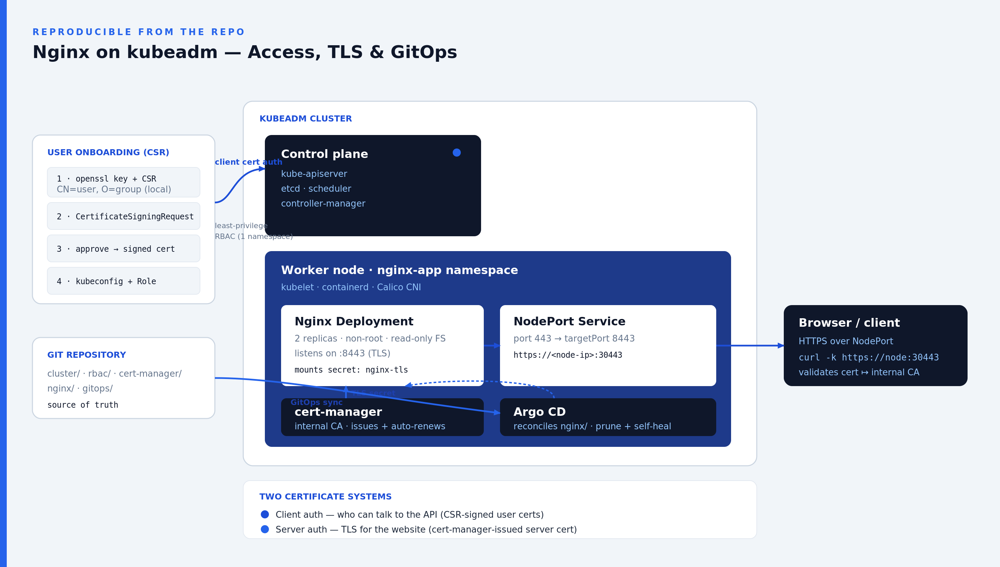

# Nginx on kubeadm: CSR-based access, cert-manager TLS, and Argo CD GitOps

A reproducible, security-focused Kubernetes deployment for the Teleport take-home:

1. A Kubernetes cluster built with **kubeadm** (3 nodes: one control plane, two workers).
2. **Nginx** deployed by an onboarded least-privilege user, not the admin.
3. **RBAC backed by Kubernetes Certificate Signing Requests (CSRs)** for API access.
4. **cert-manager** issuing and auto-renewing the TLS certificate for the site.
5. **GitOps with Argo CD** keeping the app in sync with this repo.

The design rationale, decisions and tradeoffs are in **[DESIGN.docx](DESIGN.docx)**.

## Architecture



A user is onboarded with a CSR-signed client certificate and least-privilege RBAC,
then deploys Nginx into a single namespace. cert-manager issues and auto-renews the
site's TLS certificate from an internal CA; a NodePort publishes it over HTTPS; and
Argo CD keeps the cluster in sync with Git. Note the two independent certificate
systems: **client auth** (who can reach the API) and **server auth** (TLS for the
website).

## Repository layout

```
.
├── cluster/                      # kubeadm bring-up (run on the nodes)
│   ├── 00-prereqs.sh             #   containerd + kernel settings
│   ├── 10-install-kube.sh        #   kubeadm/kubelet/kubectl from pkgs.k8s.io
│   ├── 20-init-control-plane.sh  # kubeadm init + Calico CNI
│   └── 30-join-worker.sh         #   join workers
├── rbac/                         # CSR-based user onboarding + least-privilege RBAC
│   ├── onboard-user.sh
│   └── roles/nginx-deployer-role.yaml
├── cert-manager/                 # cert-manager install + internal CA issuers
│   ├── install.sh
│   └── issuers.yaml
├── nginx/                        # the Nginx app (kustomize)
│   ├── certificate.yaml  configmap.yaml  deployment.yaml
│   ├── service.yaml      kustomization.yaml
├── gitops/                       # Argo CD install + Application
│   ├── install-argocd.sh
│   └── application.yaml
├── DESIGN.docx                   # design document
└── README.md
```

## Prerequisites

Each node needs:

- Ubuntu 22.04 LTS
- 2 vCPU and 4 GB RAM (kubeadm's floor is 2 vCPU / 2 GB; 4 GB leaves room for
  Calico, cert-manager and Argo CD)
- `sudo` access and outbound HTTPS for package and image pulls

Clone the repository onto each host:

```bash
git clone https://github.com/ugwuezev/teleport.git && cd teleport
```

Component versions are set in the scripts and overridable via environment
variables: `K8S_MINOR=v1.36`, `CALICO_VERSION=v3.28.2`,
`CERT_MANAGER_VERSION=v1.18.2`, `ARGOCD_VERSION=stable`.

## Cluster topology

A 3-node cluster: one control plane (master) and two workers. Each node is its own
Ubuntu host with an IP the others can reach.

## Where to run it

The scripts run on any three Ubuntu 22.04 hosts. This was built and validated
end-to-end on Azure (three `Standard_B2s` VMs in one VNet subnet); **Multipass is
the fastest way to reproduce it locally**.

### Local (Multipass)

[Multipass](https://multipass.run) runs Ubuntu VMs on macOS, Linux and Windows Pro.
Launch three:

```bash
multipass launch 22.04 --name master  --cpus 2 --memory 4G --disk 15G
multipass launch 22.04 --name worker1 --cpus 2 --memory 4G --disk 15G
multipass launch 22.04 --name worker2 --cpus 2 --memory 4G --disk 15G
```

`multipass list` shows each VM's IP. Open a shell on each (`multipass shell <name>`),
clone the repo, and follow the steps below. No firewall configuration is needed; you'll
browse the site at `https://<master-ip>:30443`.

### Cloud

Provision three Ubuntu 22.04 servers (for example Azure `Standard_B2s` or AWS
`t3.medium` at 2 vCPU / 4 GB; the 1 GB micro tiers are too small).

- **Same network:** put all three on one VNet/VPC subnet so they reach each other.
- **Open ports:** SSH (22) and the NodePort (30443) to your IP. Between nodes, open
  6443/tcp (API), 10250/tcp (kubelet) and 4789/udp (Calico VXLAN). On Azure, traffic
  within a VNet is already allowed by the default NSG rule, so you mainly add 22 and
  30443 from your own IP.
- **Use the private IP for kubeadm:** pass `APISERVER_ADDR=<master-private-ip>` at
  init and join the workers to the master's private IP. Use the public IP only for
  SSH and to browse the site.

## Step 1: Prepare every node

**Run on:** every node (master, worker1, worker2).

```bash
sudo cluster/00-prereqs.sh          # containerd + kernel settings, swap off
sudo -E cluster/10-install-kube.sh  # kubeadm, kubelet, kubectl (pinned)
```

## Step 2: Initialise the control plane (master)

**Run on:** master only.

```bash
# Local (Multipass): no flags needed.
sudo -E cluster/20-init-control-plane.sh

# Cloud: advertise on the master's private IP.
sudo -E APISERVER_ADDR=<master-private-ip> cluster/20-init-control-plane.sh
```

This runs `kubeadm init`, installs the Calico CNI, and writes an admin kubeconfig
to `~/.kube/config`.

## Step 3: Join the two workers

**Run on:** the token command on master; the join on each worker.

On the master, print a join command:

```bash
sudo kubeadm token create --print-join-command
```

On each worker, after Step 1, paste it:

```bash
sudo cluster/30-join-worker.sh kubeadm join <master-ip>:6443 --token <...> \
     --discovery-token-ca-cert-hash sha256:<...>
```

Confirm all three nodes are `Ready`:

```bash
kubectl get nodes -o wide
```

## Step 4: Install cert-manager and the internal CA

**Run on:** master (admin context; run `unset KUBECONFIG`).

```bash
cert-manager/install.sh
```

Installs cert-manager and a self-signed internal CA, exposing the
`internal-ca-issuer` ClusterIssuer that signs the Nginx certificate.

## Step 5: Onboard a user (CSR-based RBAC)

**Run on:** master (admin context).

```bash
rbac/onboard-user.sh anna nginx-deployers nginx-app
```

The user's private key is generated locally and never leaves the machine; the
cluster only signs the CSR. The output is `rbac/generated/anna/anna.kubeconfig`,
which grants control of the Nginx app in the `nginx-app` namespace only:

```bash
KUBECONFIG=rbac/generated/anna/anna.kubeconfig kubectl get pods                 # allowed
KUBECONFIG=rbac/generated/anna/anna.kubeconfig kubectl get pods -n kube-system  # forbidden
```

## Step 6: Deploy Nginx as that user

**Run on:** master, as anna (inline kubeconfig, so your shell stays in the admin context for Step 7).

```bash
KUBECONFIG=rbac/generated/anna/anna.kubeconfig kubectl apply -k nginx/
```

cert-manager signs the `Certificate` with the internal CA and writes the
`nginx-tls` Secret that the Deployment mounts for HTTPS.

## Step 7: Verify

**Run on:** master (admin context; not anna's kubeconfig, since `get nodes` is cluster-scoped).

```bash
kubectl get nodes -o wide             # all 3 Ready
kubectl get pods -n nginx-app         # Running
kubectl get certificate -n nginx-app  # READY=True
curl -k https://localhost:30443       # run from any node
```

From your own machine, browse the node's **public** IP: `https://<master-public-ip>:30443`.
On Azure, don't `curl` the public IP from *inside* a node: the platform doesn't route a
VM's public IP back into the VNet, so it times out; use `localhost` or the node's private IP
there. `-k` is only needed because the CA is self-signed.

The browser will warn that the connection is not private (`ERR_CERT_AUTHORITY_INVALID`).
That is expected: the certificate is issued by the in-cluster internal CA, which your browser
does not trust. Click through the warning to view the site. In production you would swap the
internal CA for a publicly-trusted issuer (ACME / Let's Encrypt).

## GitOps with Argo CD

**Run on:** master (admin) to install; reach the UI from your laptop (see below).

```bash
unset KUBECONFIG
gitops/install-argocd.sh  # REPO_URL defaults to https://github.com/ugwuezev/teleport.git
```

Argo CD reconciles the `nginx/` folder from Git and reverts manual drift.

**Access the UI.** The `argocd-server` is not exposed publicly, so reach it through a
port-forward on the master, plus an SSH tunnel from your own machine when on a cloud server:

```bash
# On the master: forward the Argo CD server to localhost:8080
kubectl -n argocd port-forward svc/argocd-server 8080:443

# Cloud only: from your own machine, tunnel to that port (run alongside the port-forward)
ssh -L 8080:localhost:8080 azureuser@<master-public-ip>

# Initial admin password (username: admin):
kubectl -n argocd get secret argocd-initial-admin-secret \
  -o jsonpath='{.data.password}' | base64 -d; echo
```

Then browse `https://localhost:8080`, accept the self-signed cert, and log in as `admin`.

## Teardown

```bash
kubectl delete -k nginx/ --ignore-not-found                         # remove the app
sudo kubeadm reset -f && sudo rm -rf /etc/cni/net.d ~/.kube/config  # reset a node
```

Delete local VMs with `multipass delete master worker1 worker2 && multipass purge`.
On cloud, terminate the servers.

## Security notes (POC scope)

- The internal CA is self-signed and lives in-cluster. Fine for a POC; in production
  use an external/managed CA or ACME (Let's Encrypt). Secrets are auto-generated by
  cert-manager and the CSR flow, and `rbac/generated/` is git-ignored.
- The Nginx pod runs non-root, read-only root FS, all capabilities dropped.
- The onboarded user has namespace-scoped, least-privilege RBAC only.

See **[DESIGN.docx](DESIGN.docx)** for the rationale, tradeoffs, and the pros and cons
of managing access this way.
